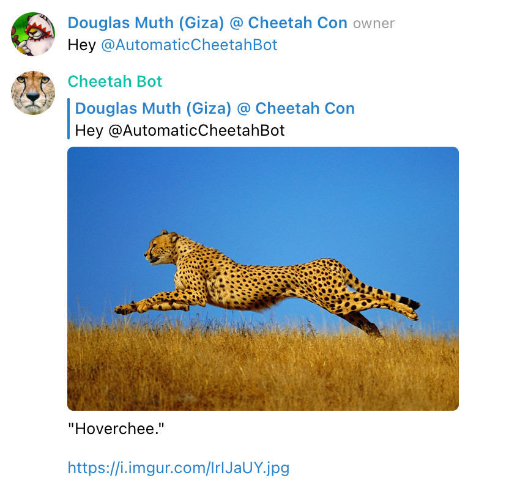

# Cheetah Bot

This script lets you run a Telegram Bot that (semi-regularly) posts pictures of cheetahs and (semi-regularly) replies to comments as if it were a cheetah.

## Features

- Will reply to every Nth message with cheetah sounds or pictures. (configurable)
- Messages with profanity or the middle finger emoji will provoke smartass responses.
- Will only interact with allowlisted groups/group IDs.
- Configurable rate limiting to prevent accidental flooding of the group.
- Age checking on messages to prevent spamming the group after a hiatus.

## Usage

- Talk to <a href="https://t.me/BotFather">@BotFather on Telegram</a> to create a bot.
- Copy down the API token.
- Go to `Bot Settings -> Group Privacy` and click `Turn Off`. This will allow your bot to see messages sent to groups it is in.
- Copy `.env-SAMPLE` to `.env` and fill out the settings.  Settings are described in detail further down.
- Add your bot to one or more groups.  Make sure the group owners are cool with this!
- Start the bot using one of the methods outlined below:

### Docker Compose

- Verify environment settings with with `docker-compose config`
- `docker-compose up`

### CLI

- `. .env` - Read the variables from our `.env file.
- `export $(cat .env | egrep "^\w" | cut -d= -f1)` - Mark those varaibles as exportable.
- `pip install -r ./requirements.txt`
- `./cheetah-bot.py` - Usage arguments will be displayed.

### Development mode

- `. .env` - Read the variables from our `.env file.
- `export $(cat .env | egrep "^\w" | cut -d= -f1)` - Mark those varaibles as exportable.
- `./bin/devel.sh` - This will start a Docker container with a `bash` shell.  Follow the instructions on screen to proceed.
- `./bin/build.sh` - Build the container only.  This is called by `bin/devel.sh`.

## Configuration

- `GROUP_IDS` - A comma-delimited list of group IDs where the bot should operate.
   - If unsure of the group ID, use `GROUP_NAMES`, and the ID will show up in the logging messages from the bot.
- `GROUP_NAMES` - A comma-delimited list of strings which are then substring matched against the name of the gorup as messages come in.  Be careful with this, because `test` will match `test`, `test2`, and `test1234`, for example.
- `ACTIONS` - Used for rate-limiting.  How many messages can be sent in a given period?
- `PERIOD` - Used for rate-limiting. How long is the period in seconds?
   - Note that the queue for sending messages is refilled based on time-elapsed.
   - For example, ACTIONS=2 and PERIOD=10 means that .2 will be added to the queue every second.
   - So if a message is sent at second 0, the queue is now 1, at 1 second, it is 1.2, then 1.4 at 2 seconds, etc. until the queue maxes out at 2.
- `REPLY_EVERY_N_MESSAGES` - Replies to every Nth message in the group.  100 is usually a good number.
   - Set to -1 to disable.
- `QUOTES_FILE` - File containing quotes.  Defaults to `./quotes.txt`
- `IMAGES_FILE` - CSV File containing image images and comments.  Defaults to `./urls.txt`.
   - Default images can be found Imgur: https://imgur.com/gallery/iisbC6p

## Good Testing Practices

I'm not even sure how to unit test against Telegram, so I have manual instructions here for now:

- Start the bot with default settings, except for `REPLY_EVERY_N_MESSAGES`, which should be 2.
- Send 2 test messages to the group, ensure the bot replies to the second message.
- Type `chee` and ensure the bot replies.
- Type an f-bomb in a message and make sure the bot catches that.
- Type a message with the bot tagged in it and ensure it replies
   - Repeat a few times to make sure it does text AND images
- Reply to a message from the bot in the gorup and ensure it replies
   - Repeat a few times to make sure it does text AND images
- Finally, send a DM to the bot and make sure it replies.

## Copyrights

- The code is copyright by me, and the license is in <a href="LICENSE">LICENSE</a>.
- The images it uses are copyright via their owners.

## Contact

My email is doug.muth@gmail.com.  I am also <a href="http://twitter.com/dmuth">@dmuth on Twitter</a> 
and <a href="http://facebook.com/dmuth">Facebook</a>!

